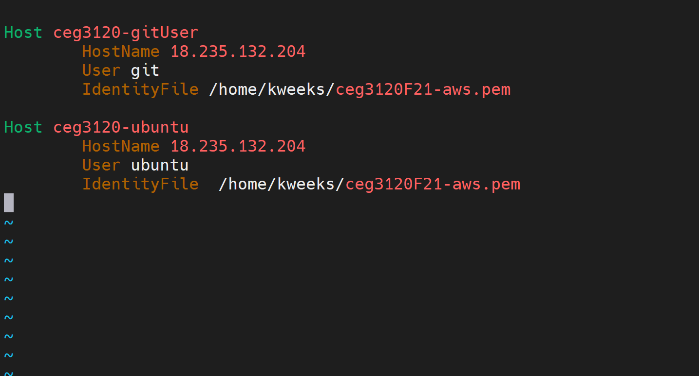
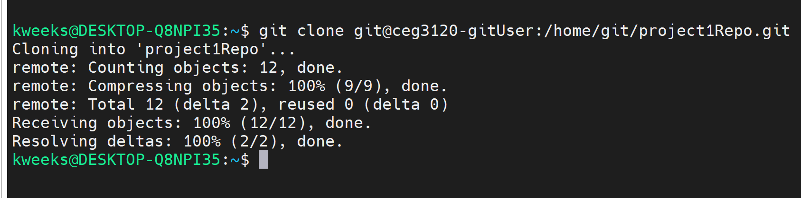
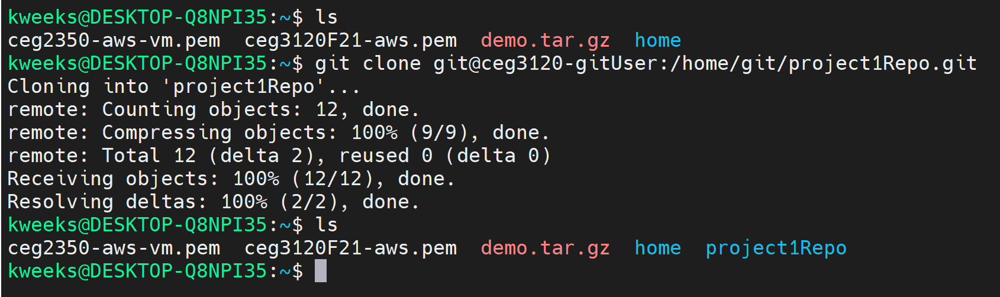

# Project 1
## Setup
1. Create a `user` on your AWS instance
    - Use the `sudo adduser insertname` command to create a new user. 
    - Use the `sudo su username` command to switch to the user that was created.  
2. Inside your user create or cd into the `.ssh` directory
    - Inside the `.ssh` directory create a file called `authorized_keys`
    - Take the public key that is in the `ubuntu` user's .ssh authorized_keys file and copy/paste it to the git user's version of the file.  
3. On the system being used to connect go into the `config` file in the .ssh directory, if this file does not exist, create it.  
    - To ssh into the user more easily you can setup the config file to essentially create a shortened ssh command.  
    - The contents that are going to be added will look like this  
    
      
    - The `host` will be the command you name it  
    - The `HostName` will be the public IP address of you AWS Instance  
    - The `user` will be whoever your trying to log in as  
    - The `IdentityFile` will be the absolute path to your private key
4. Use `git init --bare repoName` to initialize a repo in your user  

### Github commands  
1. Cloning a repository  
    - To clone a repository use `git clone user@AWS_IP:home/user/repo_name.git`  
    - The AWS_IP can be the public IP or the `host` name from the .ssh config file to log in as that user  
      
      
      
2. Add, Commit, Push  
    - You can create a file and add for tracking with `git add`
    - You can make a commit with the command `git commit -a` or `git commit -m "commit text here"`
    - To push your changes use `git push`
    